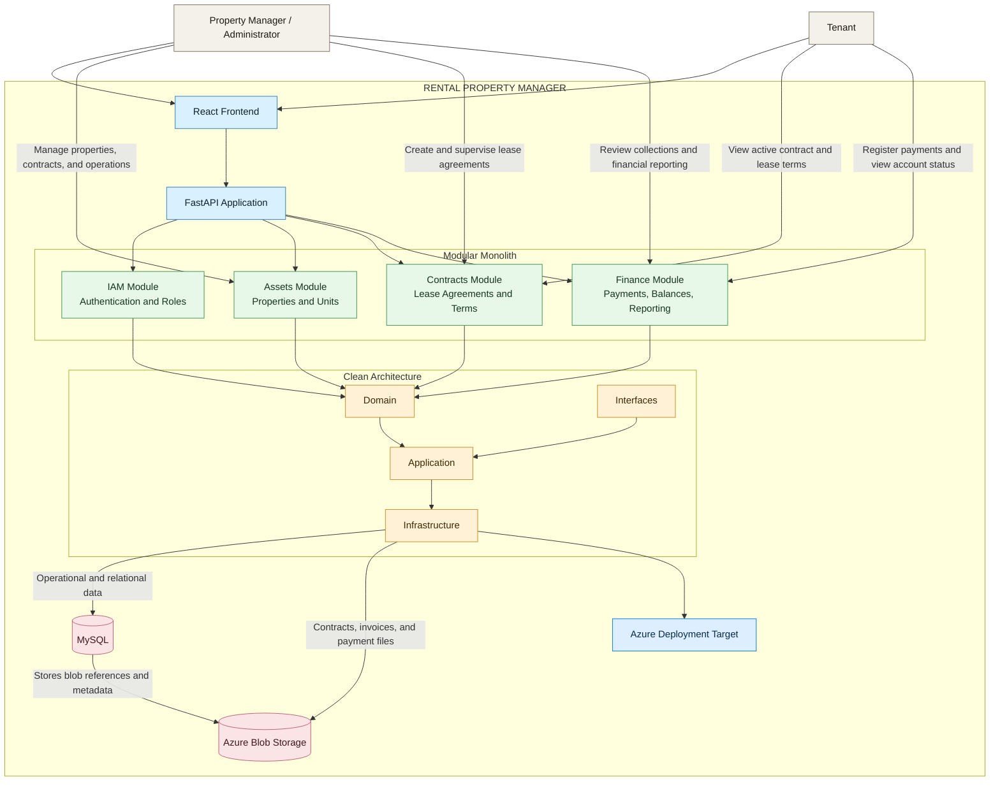
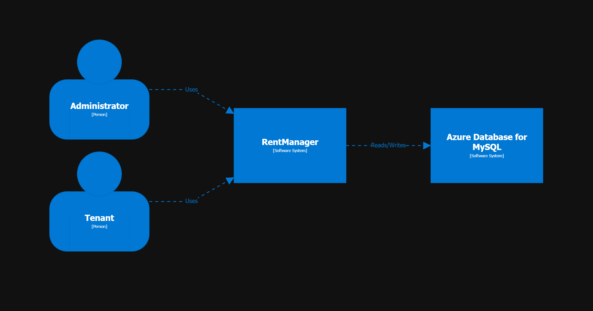
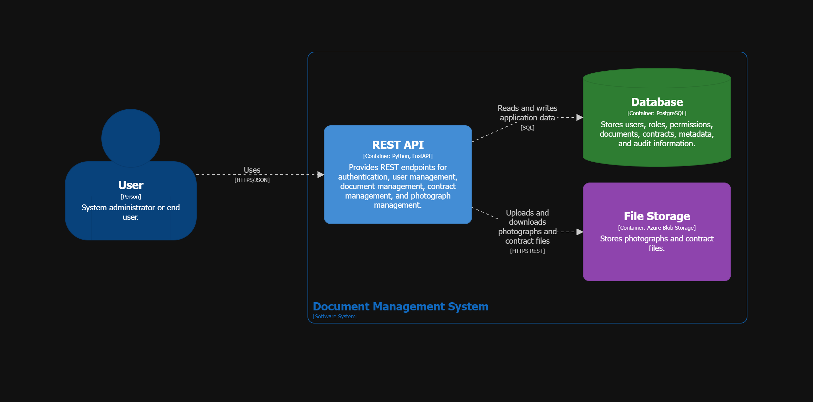
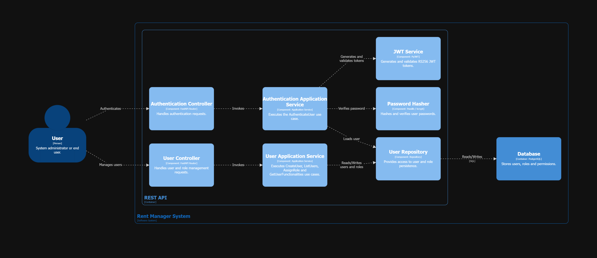
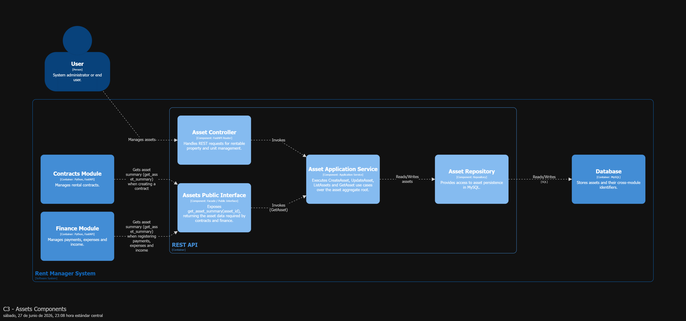
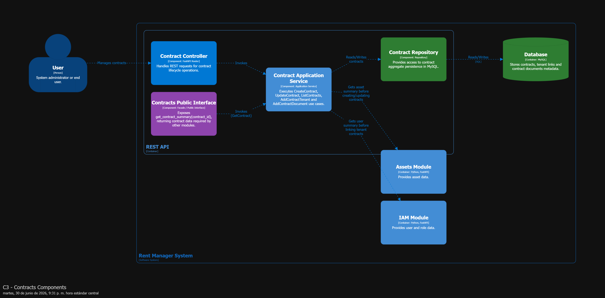
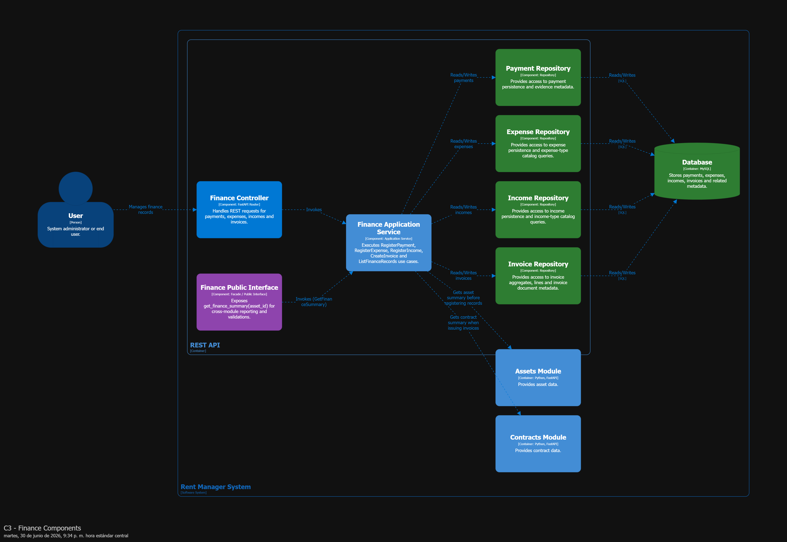

# property_management

# Rental Property Manager

[](https://www.python.org/)
[](https://fastapi.tiangolo.com/)
[](https://www.sqlalchemy.org/)
[](https://www.mysql.com/)
[](https://azure.microsoft.com/services/storage/blobs/)
[](https://react.dev/)
[](https://azure.microsoft.com/)
[](#architecture)
[](#architecture)
[](docs/)
[](https://github.com/quirosmirandavictor//property_management/commits/dev)
---

# 🧾GitHub About Metadata

**Description**

Rental property management platform built with Python, FastAPI, SQLAlchemy, MySQL, Azure Blob Storage, React, and Azure deployment in mind, organized as a modular monolith with Clean Architecture.

---

> 🔄 **Migration project, not a greenfield build.** This repository is the
> target architecture of a real migration of my own earlier version of this
> project: a Django + DRF monolith with no test coverage, tightly coupled
> business logic, and several security gaps was redesigned from the ground
> up as a modular monolith following Clean Architecture principles — moving
> the API to FastAPI and consolidating the database engine, **without
> altering the core business rules**. The "Architecture Decisions" section below document
> the actual reasoning behind each architectural decision made during that
> process.
>
> *This public repository is a reference implementation intended for
> architecture demonstration purposes; it does not reflect the production
> codebase.*
---

**Topics**

property-management, rental-platform, python, fastapi, sqlalchemy, mysql, azure-blob-storage, react, azure, clean-architecture, modular-monolith, saas

---

> **License / Usage.** This repository is published solely for professional portfolio demonstration purposes. All rights reserved. No license is granted for use, copying, modification, or distribution without the express authorization of the author.

---

# 📖 Overview

This repository contains a rental property management platform designed to centralize the operational needs of landlords and property administrators.

The system is intended to support the core lifecycle of rental operations, including tenant administration, contract handling, payment tracking, and financial visibility.

The solution is being built as a modular monolith so that business capabilities can evolve independently while remaining deployable as a single application, with a deployment path that can be extended to Azure.

---

# 🚀 Getting Started

##  🐳  Quick Start with Docker

The fastest way to get the API running locally:

```bash
cd RentManagerV2/rentmanager-api
docker-compose up
```

The API will be available at `http://localhost:8000`

For detailed setup instructions, environment configuration, and local development without Docker, see the [RentManagerV2/rentmanager-api/README.md](RentManagerV2/rentmanager-api/README.md).

---

# 🎯 Objectives

* Build a professional portfolio-grade SaaS platform for rental property administration.
* Organize business capabilities into clear application modules.
* Apply Clean Architecture to separate domain, application, infrastructure, and interface concerns.
* Provide a REST API with FastAPI for internal and external consumption.
* Persist operational and financial data in MySQL through a SQLAlchemy-based persistence layer.
* Store contracts, payment evidence, invoices, and related documents in Azure Blob Storage.
* Persist only file metadata and Blob references (URL/path/container/key) in MySQL tables.
* Deliver a modern web interface with React for property management workflows.
* Keep the solution ready for deployment to Azure as the target cloud platform.

---

# 🏗 Architecture


---
## C1 Context Diagram

<p align="center">
    
</p>

---

---
## C2 Container Diagram

<p align="center">
    
</p>

---

---
## C3 iam Container Diagram

<p align="center">
    
</p>

---

---
## C3 assets Container Diagram

<p align="center">
    
</p>

---

---
## C3 contracts Container Diagram

<p align="center">
    
</p>

---

---
## C3 finance Container Diagram

<p align="center">
    
</p>

---

# ⚙️ Technologies

| Technology | Purpose |
| ---------- | ------- |
| Python | Backend application development |
| FastAPI | HTTP API layer |
| SQLAlchemy | ORM and persistence mapping |
| MySQL | Relational data storage |
| Azure Blob Storage | File/object storage for contracts, invoices, and payment evidence |
| React | Frontend user interface |
| Docker Compose | Local service orchestration |
| Alembic | Database migrations |
| Azure | Target cloud deployment platform |
| Visual Studio Code | Development environment |

---

# Solution Structure

```text
property_manager/
│
├── README.md
│
└── RentManagerV2/
	└── rentmanager-api/
		├── pyproject.toml                  # Python project definition and dependencies
		├── docker-compose.yml              # Local service orchestration
		├── dockerfile                      # Backend container image definition
		├── alembic.ini                     # Alembic migration configuration
		├── migrations/                     # Database migration scripts
		│   ├── env.py
		│   └── versions/
		└── src/
			└── rentmanager/
				├── main.py                 # FastAPI application entry point
				├── config.py               # Application configuration
				├── modules/
				│   ├── assets/             # Properties and physical units domain
				│   ├── contracts/          # Lease agreements and contract management
				│   ├── finance/            # Payments, balances, and reporting
				│   └── iam/                # Authentication, authorization, and roles
				├── shared_kernel/          # Cross-cutting domain and infrastructure components
				└── tests/                  # Unit, integration, and end-to-end tests
```

The current backend structure already reflects the intended modular organization. Each module is separated into domain, application, infrastructure, and interface layers to keep business rules isolated from framework and persistence concerns, including a persistence approach designed around SQLAlchemy and MySQL for relational data plus Azure Blob Storage for document binaries.

---

# ✨ Features

* Property and unit management for rental portfolios.
* Tenant administration with role-aware access flows.
* Lease contract registration and consultation.
* Payment registration and tracking for rental operations.
* Contract, invoice, and payment-evidence file management backed by Blob Storage.
* Financial balance visibility for managers and tenants.
* Modular domain organization for assets, contracts, finance, and IAM.
* Clean Architecture separation between domain, application, infrastructure, and interfaces.
* Azure-ready deployment direction for future cloud rollout.


# 🧠 Architecture Decisions

## Why a Modular Monolith?

RentManager is designed as a **Modular Monolith** to balance architectural cleaness with operational simplicity. While microservices offer scalability, they introduce network latency, eventual consistency challenges, and high operational overhead that are unnecessary for the current scope of this platform.

### Key Benefits:

* **Minimized Operational Overhead** 
  Eliminates the need for complex container orchestration (like Kubernetes) or service meshes in the early stages, allowing a single deployable unit.

* **Database Integrity** 
  Leverages a shared relational database (MySQL) to enable strict ACID transactions across domains when needed, while maintaining logical data separation per module.
  
* **Domain Autonomy** 
  Each core module (IAM, Assets, Contracts, Finance) is highly cohesive and encapsulates its own business logic, allowing them to evolve independently and easing a future migration to microservices if domain traffic demands it.

## Why Clean Architecture?

Using Clean Architecture makes it possible to separate business logic
from technological details — frameworks, databases, external services. This
separation makes the system easier to maintain, allows business rules to be
unit-tested in complete isolation, and ensures the application can evolve
without being locked into technical decisions that eventually become obsolete.

This project is a practical example of that principle in action: the backend
was migrated from Django + DRF to FastAPI, and the database engine moved from
MariaDB to MySQL, **without touching a single line of domain logic or use
cases**. Only the infrastructure layer changed.

### Key Benefits

* **Technological Independence**
  The domain and use cases have zero dependencies on FastAPI, SQLAlchemy, or
  MySQL. Swapping any of these — a different web framework, a different
  database engine, a different ORM — only requires writing a new adapter.
  The business rules never change.

* **Ease of Testing**
  Use cases are tested in complete isolation using in-memory/fake
  repositories, with no database and no web server running. This keeps the
  test suite fast, deterministic, and cheap to run on every commit.

* **Scalability and Maintainability**
  The system is organized into clearly bounded modules (IAM, Assets,
  Contracts, Finance), each with explicit public interfaces. New features can
  be added to one module without risking unintended side effects in the
  others, which keeps complexity manageable as the codebase grows.

* **Flexibility in Use Cases**
  Business rules live as explicit, framework-agnostic Use Case classes
  (e.g. `AuthenticateUser`, `CalculateAssetBalance`) that can be invoked from
  any entry point — a REST endpoint today, a CLI command or a background job
  tomorrow — without duplicating logic.

## Why a Relational Database Model?

RentManager's domain is inherently relational: users relate to roles and
functionalities, contracts relate to tenants and assets, and every financial
movement (payments, expenses, income, invoices) must be traceable back to a
specific asset with full accuracy. A relational model — not a document or
key-value store — is the natural fit for this kind of structured, highly
interconnected, and transaction-sensitive data.

### Key Benefits:

* **Transactional Integrity (ACID)** 
  Financial operations — payments,
  balances, invoicing — cannot tolerate eventual consistency or partial
  writes. A relational engine guarantees that every transaction either fully
  commits or fully rolls back, which is non-negotiable for money-related
  data.

* **Native Support for Complex Relationships** 
  Foreign keys and constraints
  enforce data integrity at the database level — a second line of defense
  beyond domain validation — instead of relying on duplicated or denormalized
  data scattered across documents.

* **Powerful Querying and Aggregation** 
  Use cases like `CalculateAssetBalance`
  rely on joins and aggregate functions across multiple tables (income,
  expenses, payments) to compute accurate results. This is exactly what SQL
  engines are optimized for, and it would require significant denormalization
  or application-side computation in a NoSQL model.

* **Mature Tooling and Ecosystem** 
  Schema migrations (Alembic), a
  battle-tested ORM (SQLAlchemy), and decades of operational knowledge reduce
  risk compared to adopting a less standardized query interface for a domain
  that doesn't need horizontal write-scaling at its current scope.

## Why Blob Storage for Files?

Contract documents, invoice files, and payment photos are binary objects with
different access and lifecycle requirements than transactional records.
Persisting those files directly in relational tables would increase table size,
impact query performance, and complicate retention and serving concerns.

### Key Benefits:

* **Database Performance Protection**
	MySQL stays focused on relational and transactional data. Only file
	references and metadata are stored in tables, keeping indexes and query
	plans efficient.

* **Scalable Object Storage**
	Blob Storage is optimized for large/unbounded binary objects, versioning,
	and lifecycle management policies, which are ideal for document-heavy
	workflows.

* **Clear Separation of Responsibilities**
	The data model keeps business entities in relational tables while external
	object storage handles file content. This aligns with Clean Architecture and
	reduces coupling between transactional logic and file delivery concerns.

---
